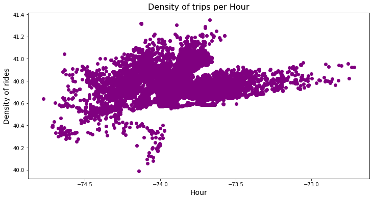
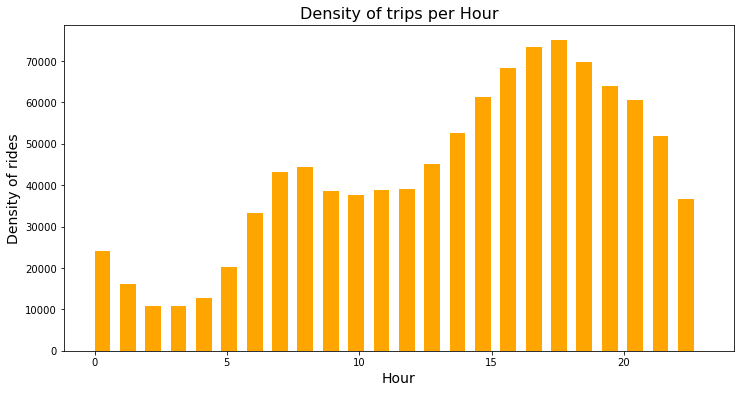
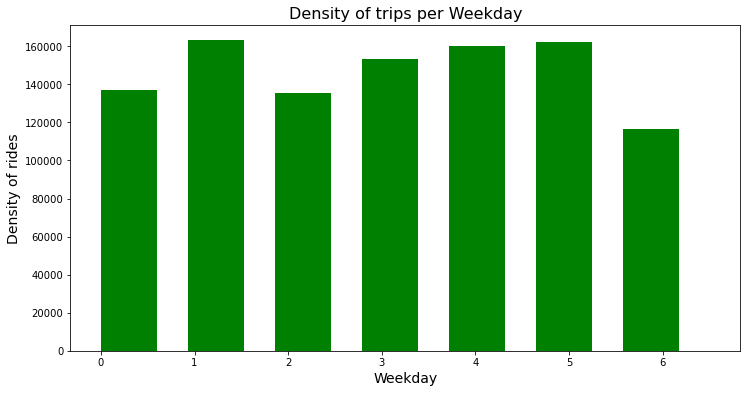
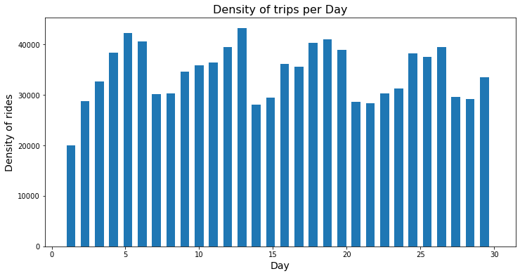

# 🚕 Uber Trips Analysis

This project performs Exploratory Data Analysis (EDA) on Uber trip data using Python, Pandas, and Matplotlib. The analysis explores Uber trip patterns based on **hour, weekday, day of the month, and geographical location**.

## 📌 Project Overview

The objective of this project is to analyze Uber trip data and identify useful patterns in ride demand.

The analysis includes:

- Dataset exploration
- Date and time feature extraction
- Trip analysis by hour
- Trip analysis by weekday
- Trip analysis by day of the month
- Geographical visualization of Uber trips
- Data visualization and interpretation

## 🗂️ Dataset

The analysis uses the **Uber Raw Data – September 2014** dataset.

Main columns:

- `Date/Time` – Date and time of the trip
- `Lat` – Latitude of the trip
- `Lon` – Longitude of the trip

Additional features extracted from `Date/Time`:

- `Day`
- `Hour`
- `Weekday`

## 🛠️ Technologies Used

- Python
- Pandas
- Matplotlib
- Jupyter Notebook

## 📊 Visualizations & Analysis

### 1. Density of Trips per location



### 2. Density of Trips per Hour



**Key observation:** Trip demand increases substantially during the afternoon and evening, with the highest demand around **5 PM–6 PM**.

### 3. Density of Trips per Weekday



**Key observation:** Trip volume varies across weekdays, with comparatively lower demand on the weekend.

### 4. Density of Trips per Day



**Key observation:** Trip volume fluctuates from day to day, with several days showing noticeably higher demand.

## 💡 Key Insights

- Uber demand changes considerably throughout the day.
- Afternoon and evening hours have substantially higher trip volumes.
- Trip demand varies across weekdays.
- Daily trip volume fluctuates throughout the month.
- The geographical plot shows a concentrated distribution of trips around the New York City area.
- Time-based feature engineering makes it easier to identify demand patterns.

## 📁 Project Structure

```text
Uber-Trips-Analysis/
│
├── Uber Trips Analysis.ipynb
├── uber-raw-data-sep14.csv
├── README.md
│
└── screenshots/
    ├── density-of-per-trip.png
    ├── density-per-hour.png
    ├── density-weekend.png
    └── density.png
```

## ▶️ How to Run

```bash
pip install pandas matplotlib jupyter
jupyter notebook
```

Open `Uber Trips Analysis.ipynb` and run the cells sequentially.

## 🎯 Skills Demonstrated

- Exploratory Data Analysis
- Data Cleaning and Transformation
- Feature Engineering
- Data Visualization
- Time-Based Analysis
- Python Data Analysis

## 👤 Author

**Aman**
